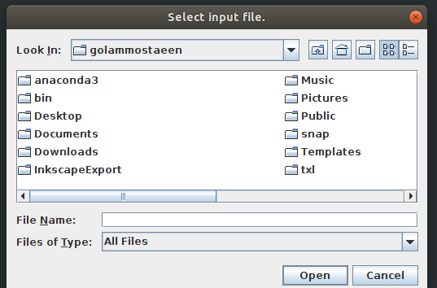
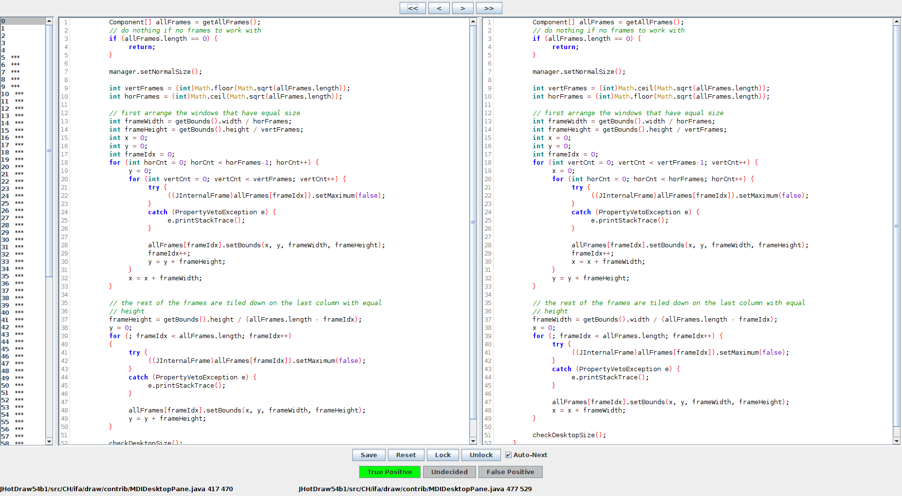

<p align="center">
  
</p>

## 1.0 Machine Learning Based Code Clone Validation Framework
[](#sponsors)
[](#backers)
[](#sponsors)
[](#sponsors)
[](#sponsors)

A code clone is a pair of code fragments, within or between software systems that are similar. 
Since code clones often negatively impact the maintainability of a software system, a great many 
numbers of code clone detection techniques and tools have been proposed and studied over the last 
decade such as, NiCAD [2], Cloneworks [3], SourcererCC [4] and so on. To detect all possible similar 
source code patterns in general, the clone detection tools work on syntax level (such as texts, tokens, 
AST and so on) while lacking user-specific preferences. This often means the reported clones must be 
manually validated prior to any analysis in order to filter out the true positive clones from task or 
user-specific considerations. This manual clone validation effort is very time-consuming and often error-prone, 
in particular for large-scale clone detection.

This is a machine learning based framework for automatic code clone validation - developed based on our recent 
research study [1]. The method learns to predict tasks or user-specific code clone validation patterns. 
The current  machine learning model has been build based on BigCloneBench [5] - a collection of eight million validated clones within 
IJaDataset-2.0, a big data software repository containing 25,000 open-source Java systems. In addition to the useability of 
the trained model locally for code clone classification, this cloud based framework also supports the communication with any 
existing code clone detection tools for valdiation prediction responses using REST API. Please refer to the paper for 
additional details of the framework [1].


## 2.0 Installation

#### 2.1 Install TXL
Install TXL from [here](https://www.txl.ca/txl-download.html), according to your OS and make sure
the TXL resides in `/usr/local/bin/txl`. You can use the following command from terminal to double check
the installation location.
```buildoutcfg
$ whereis txl
```


#### 2.2 Git Clone
 Clone the project from git. And `cd` to the project root:
```buildoutcfg
$ git clone https://github.com/pseudoPixels/ML_CloneValidationFramework.git
$ cd ML_CloneValidationFramework
```

#### 2.3 Create virtual Env. & Install
Create a new virtual environment with `Python 2.7`. Activate the newly created
environment. Using Anaconda is recommended for creating an independent installation setup. 
[Download & Setup Anaconda](https://www.anaconda.com/distribution/) as per your OS. Finally, install the requirments from the `ML_CloneValidationFramework` 
project root as the following commands: 
```buildoutcfg
$ conda create -n cloneVal python=2.7
$ conda activate cloneVal
$ pip install -r requirements.txt
$ pip install .
```

Done! Use `$ pip freeze` command from the terminal to double check for `mlCVF` as a test of the successful installation. 


## 3.0 Auto ML Validation (Usage Instructions)
#### 3.1 Example
On installation, run the following command from the terminal to
start automatic validation of `JHotDraw54b1` software project located
at `input_clone_pairs/` directory. `JHotDraw54b1_clones.xml` is the output clone
report file obtained from the NICAD [2] clone detection tool. In addition to showing the validation
status in the terminal, the report is saved in `out/` directory.
```buildoutcfg
$ python autoValidateClones.py  -in 'JHotDraw54b1_clones.xml' -out 'out/'
```


#### 3.2 Validation Options
For validation options and help run `python autoValidateClones.py  -h` from the terminal.
It should present the options for validation from this framework, such as:

```buildoutcfg
$ python autoValidateClones.py  -h

usage: autoValidateClones.py [-h] -in INPUT_CLONE_FILE -out OUTPUT_DIR
                             [-t VAL_THRESHOLD]

This is a machine learning based framework for automatic code clone
validation.

optional arguments:
  -h, --help            show this help message and exit
  -in INPUT_CLONE_FILE  (required) input clone file (i.e., output from NICAD)
  -out OUTPUT_DIR       (required) target output directory of machine learning
                        validated clones
  -t VAL_THRESHOLD      (optional) the threshold for automatic clone
                        validation. Default=0.7
```

#### 3.3 Validating Clones of new Software Systems
Let's say we have a software system `NewSoft` for clone validation. We first detect
clones of it using NICAD. NICAD will generate a clone report `NewSoft_clones.xml` for the corresponding 
software system. For validation of the detected clones using machine learning copy and paste both `New_Soft` and
`NewSoft_clones.xml` in `input_clone_pairs/` directory of the project and run the following command:

```buildoutcfg
$ python autoValidateClones.py  -in 'NewSoft_clones.xml' -out 'out/' -t 0.85
```
It will start the automatic validation of the clones and write the reports in `out/` directory.
Besides, the validation progress is also presented in the terminal.

**Important:** Please make sure that the `file` attribute of the clone file `NewSoft_clones.xml` 
is in relative path (i.e., starting with `NewSoft/and/so/on`). This is important as the automatic
validation process requires to extract source codes for the corresponding reported clone pairs. For clarification,
please look into the `file` attributes of example `JHotDraw54b1_clones.xml` clone file from `input_clone_pairs/` directory.


#### 3.4 Outputs
The framework creats output file containing validation information for each of the clone files in `out/` directory. 
The extensions of the output files are - `.mlValidated`, which can be loaded as csv formats for 
further analysis of the validation results. The validation response (e.g., true/false) for each 
of the clone pairs are as follows. You will get overall validation statistics (e.g., precision 
and so on) in your console and will also be written in `__CLONE_VALIDATION_STATS.txt` file in 
your specified output directory (e.g., in <Output Directory> ).
```
validation_response,fragment_1_path,fragment_1_startline,fragment_1_endline,fragment_2_path,fragment_2_startline,fragment_2_endline
```


## 4.0 Manual Validation (Usage Instruction)
As reported above, the reported clones from a clone detection tools can be
manually validated using the project for building the further training set. The
training set can later be used for improving the machine learning model. For the manual
validation, please `cd` to `manual_validator` directory of the project, such as:
```buildoutcfg
$ cd manual_validator
``` 
Copy and paste the software project such as `JHotDraw54b1` and its detected clone file
`JHotDraw54b1_clones.xml` (i.e., from NICAD) in `manual_validator/input_clone_pairs` directory.
And then run the following command from terminal for starting the manual validation process.

```buildoutcfg
$ python manualValidate.py -in 'JHotDraw54b1_clones.xml'
```
The command will pop-up a window as the following (this validation program was developed by **Jeff Svajlenko**). 
Browse to you the clone file such as `JHotDraw54b1_clones.xml.clones`
from the window (**Note:** Please note the file name, its a `.clones` file NOT the earlier pasted clone file `JHotDraw54b1_clones.xml`. 
The `.clones` file is generated by this system with suitable format for the validation. So, please browse and select the
corresponding `.clones` file as input). After browsing and selecting the clone file, the window will also further ask for selecting
a file for writing the manual validation responses. You can create and select any file (such as, `myManualCloneValReport.csv`) for writing the output.



On selecting both the input clone file and the output response file, it will launch
the validation window as following. It will iterate over all the clones available in the
clone file for corresponding manual validation response on the clone pairs.


After manual validation of the clones, the output file (such as `myManualCloneValReport.csv` in this case) can later be
used for training the machine learning models or any other research purposes.

## 5.0 Train New Model
You can use the newly validated clone sets (from the previous Section 4.0) to train new custom model. The newly trained
model can be used for custom validation. Following is an example for starting the training. Here, `-in` specifies the
manual validated file, and `-out` specifies the name of the newly trained model to save as (all models are saved at 'pybrain/' folder).
```
$python train.py -in 'JHotDraw54b1_clones.xml.clones2' -out 'newlyTrainedModel'
```


## 6.0 Bugs/Issues?
Please add your issues or bug reports to this git repository. We track the issues for further improvement of the framework. 


## 7.0 References
[1] Mostaeen, G., Svajlenko, J., Roy, B., Roy, C. K., & Schneider, K. (2018, September). On the Use of Machine Learning Techniques Towards the Design of Cloud Based Automatic Code Clone Validation Tools. In Source Code Analysis and Manipulation (SCAM), 2018 IEEE 18th International Working Conference on. IEEE. 

[2] Roy, C. K., & Cordy, J. R. (2008, June). NICAD: Accurate detection of near-miss intentional clones using flexible pretty-printing and code normalization. In Program Comprehension, 2008. ICPC 2008. The 16th IEEE International Conference on (pp. 172-181). IEEE. 

[3] Svajlenko, J., & Roy, C. K. (2017, May). Cloneworks: A fast and flexible large-scale near-miss clone detection tool. In Proceedings of the 39th International Conference on Software Engineering Companion (pp. 177-179). IEEE Press. 

[4] Sajnani, H., Saini, V., Svajlenko, J., Roy, C. K., & Lopes, C. V. (2016, May). SourcererCC: scaling code clone detection to big-code. In Software Engineering (ICSE), 2016 IEEE/ACM 38th International Conference on (pp. 1157-1168). IEEE. 

[5] Svajlenko, J., & Roy, C. K. (2015, September). Evaluating clone detection tools with bigclonebench. In Software Maintenance and Evolution (ICSME), 2015 IEEE International Conference on (pp. 131-140). IEEE. 

[6] Ambient Software Evoluton Group. IJaDataset 2.0. http://secold.org/projects/seclone.


