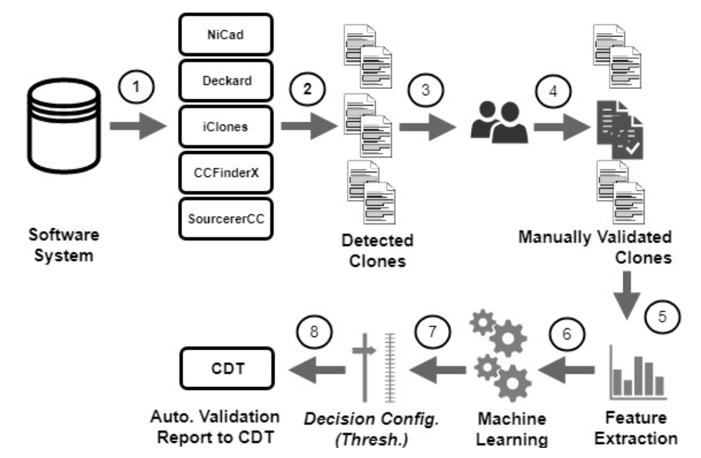

## 1.0 Machine Learning Based Code Clone Validation Framework
A code clone is a pair of code fragments, within or between software systems that are similar. 
Since code clones often negatively impact the maintainability of a software system, a great many 
numbers of code clone detection techniques and tools have been proposed and studied over the last 
decade such as, NiCAD [2], Cloneworks [3], SourcererCC [4] and so on. To detect all possible similar 
source code patterns in general, the clone detection tools work on syntax level (such as texts, tokens, 
AST and so on) while lacking user-specific preferences. This often means the reported clones must be 
manually validated prior to any analysis in order to filter out the true positive clones from task or 
user-specific considerations. This manual clone validation effort is very time-consuming and often error-prone, 
in particular for large-scale clone detection.

This is a machine learning based framework for automatic code clone validation - developed based on our recent 
research study [1]. The method learns to predict tasks or user-specific code clone validation patterns. Following is the high-level architecture of the clone validation framework (Please refer to our <a href='https://ieeexplore.ieee.org/stamp/stamp.jsp?tp=&arnumber=8530729&tag=1' target="_blank">original paper</a> for details on the architecture).

<p align="center">
  
</p>

The current  machine learning model has been build based on BigCloneBench [5] - a collection of eight million validated clones within 
IJaDataset-2.0, a big data software repository containing 25,000 open-source Java systems. In addition to the useability of 
the trained model locally for code clone classification, this cloud based framework also supports the communication with any 
existing code clone detection tools for valdiation prediction responses using REST API. Please refer to the paper for 
additional details of the framework [1].


## 2.0 Installation
* Clone the project from git. And `cd` to the project root:
```buildoutcfg
$ git clone https://github.com/pseudoPixels/ML_CloneValidationFramework.git
$ cd ML_CloneValidationFramework
```

* Create a new virtual environment with `Python 2.7`. Activate the newly created
environment and install the requirments from the `ML_CloneValidationFramework` project root: 
```buildoutcfg
$ conda create -n cloneVal python=2.7
$ conda activate cloneVal
$ pip install -r requirements.txt
```


## 3.0 Usage Instructions
On Cloning and setting up the required environment for this project, you need to follow the speps below:

###### 1. Make sure in the project directory
```
$cd ML_CloneValidationFramework
```

###### 2. Check the clone file format for validation
The framework works on a set of clone files (output of a code clone detection tools) for validation. The used xml format for parsing the clone pairs are as follows. All the detected clone pairs - `clone`, should have to be children of the root tag - `clones`. A `clone` contains details information (e.g., in `source` tag) and codes (e.g., in `code` tag) for both of its clone fragments. Copy all such clone files in a directory for starting the validation (e.g., as next step).    
```
<clones>
    <clone>
        <source file= "selected/1966294.java" startline= "168" endline= "181" />
        <code> 
            //clone fragment 1
        </code>
        
        <source file= "selected/1966294.java" startline= "58" endline= "65" />
        <code> 
            //clone fragment 2
        </code>
    </clone>
    ...
    ...
<clones>
```


###### 3. Run the `validateClones.py` script as following:
```
$python validateClones.py -i 'input_clone_directory/' -o 'validated_clone_out_dir/' -t 0.5
```
The options:
```buildoutcfg
Usage: validateClones.py [options] arg

Options:
  -h, --help            show this help message and exit
  -i INPUTDIR, --input=INPUTDIR
                        input directory of detected code clones
  -o OUTDIR, --output=OUTDIR
  -t CLONETHRESHOLD, --threshold=CLONETHRESHOLD

```
###### 4. Outputs
The framework creats output file containing validation information for each of the clone files. The extensions of the output files are - `.mlValidated`, which can be loaded as csv formats for further analysis of the validation results. The validation response (e.g., true/false) for each of the clone pairs are as follows. You will get overall validation statistics (e.g., precision and so on) in your console and will also be written in `__CLONE_VALIDATION_STATS.txt` file in your specified output directory (e.g., in <Output Directory> ).
```
validation_response,fragment_1_path,fragment_1_startline,fragment_1_endline,fragment_2_path,fragment_2_startline,fragment_2_endline
```


## 4.0 Example: Hello World Validation
For testing if everything has been set up accordingly, you can run the validation on a provided clone file with this framework. The sample clone pairs are available in `input_clone_pairs` directory. So, you can run the following command to test the successfull installation of the framework. If evererythin works fine, you should get validation statistics (e.g, precision, TP clones and so on) on your console. The validation statistics will also be available in `__CLONE_VALIDATION_STATS.txt` file in `Out/` directory.
```
$python validateClones.py -i 'input_clone_pairs/' -o 'out/' -t 0.5
```


## 5.0 Bugs/Issues?
Please add your issues or bug reports to this git repository. We track the issues for further improvement of the framework. 


## 6.0 References
[1] Mostaeen, G., Svajlenko, J., Roy, B., Roy, C. K., & Schneider, K. (2018, September). On the Use of Machine Learning Techniques Towards the Design of Cloud Based Automatic Code Clone Validation Tools. In Source Code Analysis and Manipulation (SCAM), 2018 IEEE 18th International Working Conference on. IEEE. 

[2] Roy, C. K., & Cordy, J. R. (2008, June). NICAD: Accurate detection of near-miss intentional clones using flexible pretty-printing and code normalization. In Program Comprehension, 2008. ICPC 2008. The 16th IEEE International Conference on (pp. 172-181). IEEE. 

[3] Svajlenko, J., & Roy, C. K. (2017, May). Cloneworks: A fast and flexible large-scale near-miss clone detection tool. In Proceedings of the 39th International Conference on Software Engineering Companion (pp. 177-179). IEEE Press. 

[4] Sajnani, H., Saini, V., Svajlenko, J., Roy, C. K., & Lopes, C. V. (2016, May). SourcererCC: scaling code clone detection to big-code. In Software Engineering (ICSE), 2016 IEEE/ACM 38th International Conference on (pp. 1157-1168). IEEE. 

[5] Svajlenko, J., & Roy, C. K. (2015, September). Evaluating clone detection tools with bigclonebench. In Software Maintenance and Evolution (ICSME), 2015 IEEE International Conference on (pp. 131-140). IEEE. 

[6] Ambient Software Evoluton Group. IJaDataset 2.0. http://secold.org/projects/seclone.


